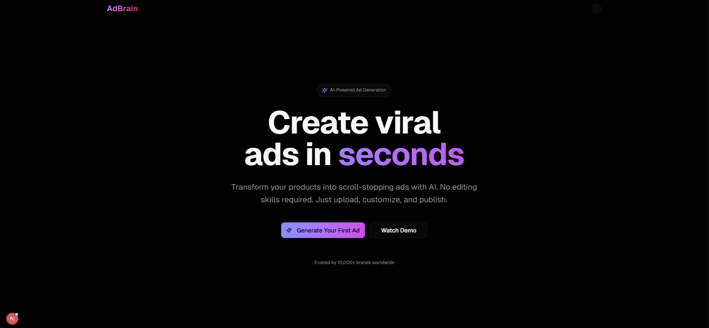

Here’s a rewritten version of your README — fully tailored for **AdBrain**, reflecting your actual stack (Next.js, FastAPI, Supabase, AWS S3, Google Veo) and refined for a hackathon submission. It’s professional yet readable, and ready for Devpost or GitHub.

---

<a id="readme-top"></a>

<!-- PROJECT LOGO -->

<br />
<div align="center">
  <h1 align="center">🧠 ADBRAIN</h1>

  <p align="center">
    AI-Powered Ad Generator — Create high-quality promotional videos in seconds.
    <br />
    <br />
    Built at <strong>CalHacks 12.0</strong>
    <br />
    <br />
  </p>
</div>

---

## 🧩 About the Project

**AdBrain** revolutionizes digital marketing by automatically generating professional ad videos from simple text or product descriptions.

Creators, small businesses, and event organizers can instantly turn ideas into compelling marketing content — powered by AI video generation via **Google Veo**, scalable cloud storage with **AWS S3**, and seamless backend orchestration through **FastAPI** and **Supabase (PostgreSQL)**.

### ✨ Features

* 🪄 **AI Video Generation** using Google Veo API
* 📦 **AWS S3 Integration** for secure video storage
* 🔐 **Supabase Auth & Database** for user and video management
* ⚡ **FastAPI Backend** with async video processing
* 🌐 **Next.js Frontend** with a modern dashboard and upload preview
* 📱 Auto-generated thumbnails and progress tracking



<p align="right">(<a href="#readme-top">back to top</a>)</p>

---

## 🧰 Built With

This project combines modern full-stack tools with cutting-edge AI generation:


<p align="right">(<a href="#readme-top">back to top</a>)</p>

---

## ⚙️ Getting Started

Follow these steps to run AdBrain locally:

### 📋 Prerequisites

* Node.js (v18 or higher)
* Python (v3.10 or higher)
* AWS S3 credentials and Supabase project setup

### 🧾 Installation

1. **Clone the repository**

   ```bash
   git clone https://github.com/brian-fu/adbrain.git
   cd adbrain
   ```

2. **Set up environment variables**

   Create `.env` files for both frontend and backend:

   **Frontend (`frontend/.env.local`):**

   ```
   NEXT_PUBLIC_SERVER_URL=http://localhost:8000
   NEXT_PUBLIC_SUPABASE_URL=your_supabase_project_url
   NEXT_PUBLIC_SUPABASE_ANON_KEY=your_supabase_anon_key
   ```

   **Backend (`backend/.env`):**

    ```
    GOOGLE_AI_API_KEY=enter_your_google_ai_api_key_here
    GOOGLE_PROJECT_ID=enter_your_google_project_id_here
    
    #Supabase DB
    DB_URL=enter_your_supabase_db_url_here
    
    #AWS
    AWS_ACCESS_KEY_ID=enter_your_aws_access_key_id_here
    AWS_SECRET_ACCESS_KEY=enter_your_aws_secret_access_key_here
    AWS_REGION=enter_your_aws_region_here
    AWS_S3_BUCKET_NAME=enter_your_aws_s3_bucket_name_here
    
    # INSTAGRAM
    INSTAGRAM_APP_NAME=your_app_name_here
    INSTAGRAM_APP_ID=your_app_id_here
    INSTAGRAM_KEY=your_instagram_secret_key_here
    
    #Application Settings
    DEBUG=true
    HOST=127.0.0.1
    PORT=8000
    
    SUPABASE_URL=enter_your_supabase_url_here
    SUPABASE_ANON_KEY=enter_your_supabase_anon_key_here
    SUPABASE_SERVICE_ROLE_KEY=enter_your_supabase_service_role_key_here
    SUPABASE_JWT_SECRET=enter_your_supabase_jwt_secret_here
    ```

3. **Install dependencies**

   ```bash
   # Frontend
   cd frontend
   npm install

   # Backend
   cd ../backend
   pip install -r requirements.txt
   ```

4. **Run the app**

   ```bash
   # Start FastAPI server
   python -m backend.main

   # Start Next.js frontend
   cd ../frontend
   npm run dev
   ```

<p align="right">(<a href="#readme-top">back to top</a>)</p>

---

## 🚀 Usage

1. **Sign up / Log in** via Supabase authentication
2. **Enter a short product or event description**
3. AdBrain uses **Google Veo** to generate a promotional video
4. **Preview, edit, and download** your AI-generated ad
5. All videos are stored securely in **AWS S3** for later access

---

## 🧑‍💻 Team & Acknowledgements

Built by **Brian Fu** and **Brian An** at **CalHacks 12.0**
Special thanks to Google Veo, AWS, and Supabase for powering AdBrain’s infrastructure.

---
